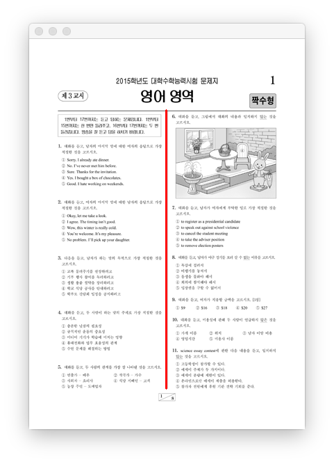

# KSAT taking machine using Natural Language Processing
## Abstract

# 자연어처리를 활용한 수능 문제 풀이 장치
## 요약

## 수능 문제 데이터 분류
PDF형태로 수능 문제 데이터에서 문제를 뽑아내고 분류하는 작업이 선행되어야한다.

1. PDF파일을 이미지로 Export해서 문제가 위치한 영역을 판별한다.
 - OpenCV의 Line Detection 기술로 세로로 가장 긴 선분을 탐지한다. 
 - 시험 정보 데이터 영역 : 첫페이지에서 탐지한 세로영역 위에 위치한 텍스트 
 - 문제 데이터 영역 : 탐지한 세로 영역에 위치한 텍스트 
2. 시험 정보 데이터 파싱
 - 문제지 이름 : `\d{4}학년도.+문제지` 
 - 문제지 유형 : `(A|B)형` 
3. 쓰래기 문자 제거
 - `\n\]\[` => `\n`
 - `^( )+` => ``
 - `\n+(?=`+number+`\.)` => `\n`
4. 문제 텍스트 파싱
 - 문제 번호 : `(((^\d)|(^\d{2}))(?=\.))` 
 - 해당 번호의 문제 전체 : `(^`number`\.)(()|(.))+(\n.+)+(?=(\n`(number+1)`\.))` 
 - 
